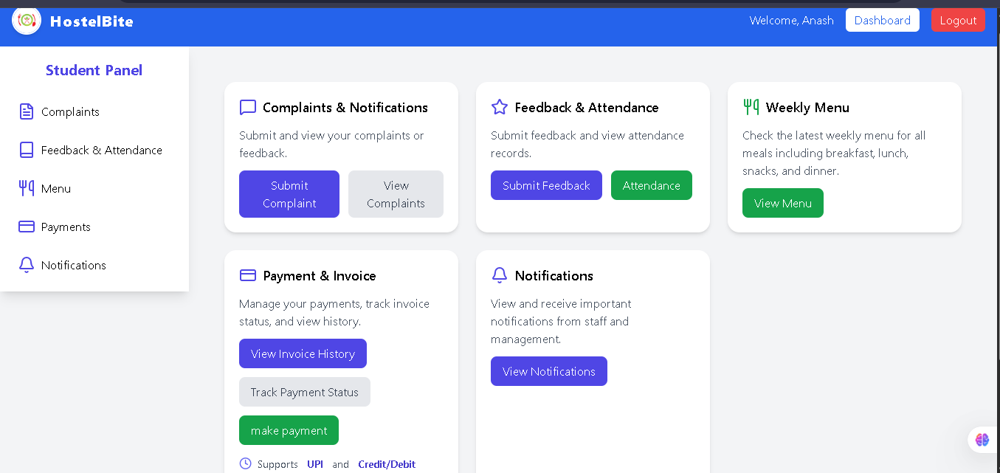
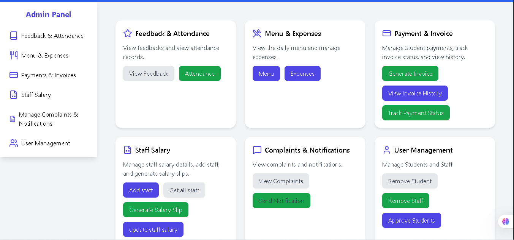
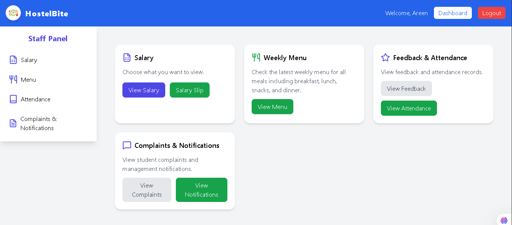
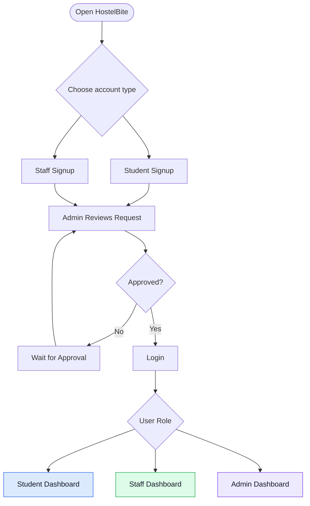
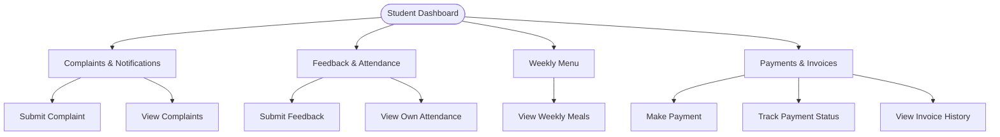
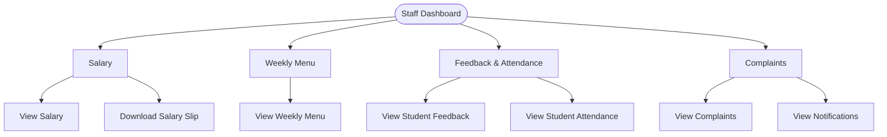
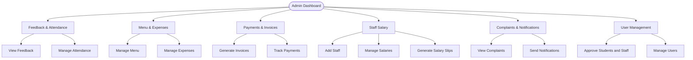
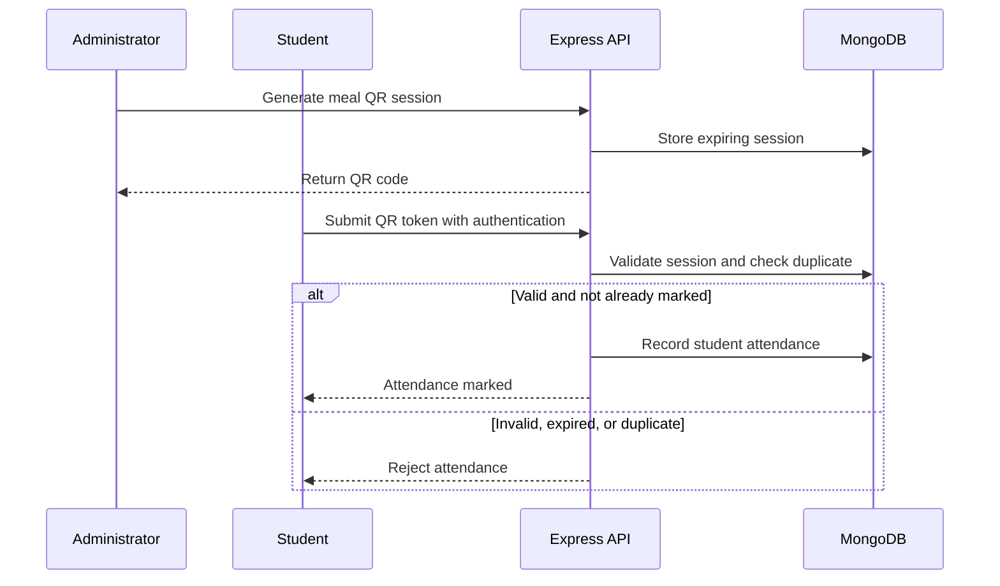
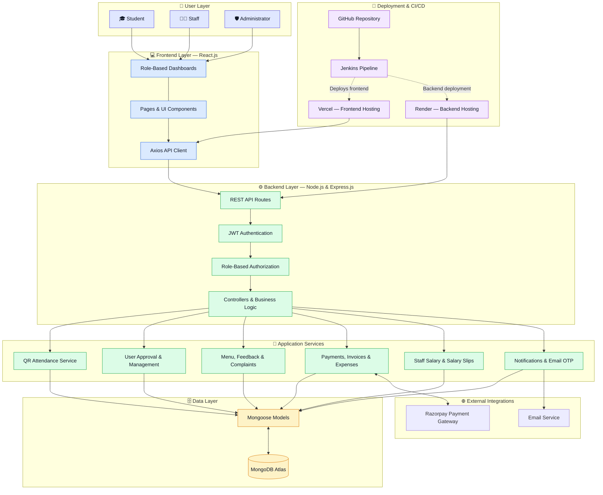
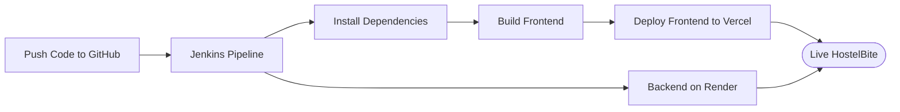

# 🍽️ HostelBite — Hostel Mess Management System

A full-stack **MERN application** that simplifies hostel mess management through role-based dashboards for Students, Staff, and Administrators.

🌐 **Live Demo:** [Frontend](https://hostelbite-project.vercel.app) · [Backend API](https://hostelbite.onrender.com)

## 🖥️ Dashboard Preview

### Student Dashboard


### Admin Dashboard


### Staff Dashboard



Demo Login Credentials

You can explore the application using the following demo accounts.

Admin Account

    Email: Nizzakhan069@gmail.com
    Password: Abc1234@

    

## ✨ Features at a Glance

| Module | Student | Staff | Admin |
|---|:---:|:---:|:---:|
| Account registration | ✅ | ✅ | — |
| Approval management | — | — | ✅ |
| Weekly menu | View | View | Manage |
| Feedback & attendance | Submit / View own records | View student records | View / Manage |
| Complaints & notifications | Submit / View | View | Manage / Send |
| Payments & invoices | Pay / Track | — | Generate / Track |
| Salary & salary slips | — | View / Download | Manage |
| User management | — | — | Manage |
| Expenses | — | — | Manage |

## 🔄 How HostelBite Works



**Account security:** Students and staff must receive administrator approval before logging in. Administrator accounts are created through a trusted administrative process, not public signup.

## 👨‍🎓 Student Dashboard



- Register, log in, and view profile details.
- Submit complaints and feedback.
- View the weekly breakfast, lunch, snacks, and dinner menu.
- Scan attendance QR codes and view personal attendance history.
- Make payments and track payment and invoice status.
- Receive notifications from staff and administration.

## 🧑‍🍳 Staff Dashboard

Staff members have **four main sections**:



| Section | Functionality |
|---|---|
| 💰 Salary | View salary details and download salary slips. |
| 🍽️ Weekly Menu | View the weekly hostel meal menu. |
| ⭐ Feedback & Attendance | View student feedback and attendance records. |
| 🔔 Complaints | View complaints and notifications. |

## 🛡️ Admin Dashboard



- Approve student and staff signup requests.
- Manage student and staff accounts.
- Manage weekly menus, mess expenses, and attendance.
- Review feedback and complaints.
- Generate invoices and track payments.
- Add staff, manage salaries, and generate salary slips.
- Send notifications to users.

## 📱 QR-Based Attendance



- QR sessions expire after five minutes.
- Only authenticated, approved students can mark attendance.
- Attendance is associated with the authenticated student.
- A database uniqueness constraint prevents duplicate attendance for the same meal on the same UTC date.
- MongoDB automatically removes expired QR session records using a TTL index.

## 🏗️ System Architecture



### Architecture Overview

- **Frontend:** React.js provides separate dashboards for Students, Staff, and Administrators.
- **Backend:** Express.js exposes REST APIs protected by JWT authentication and role-based authorization.
- **Application services:** Handle account approvals, QR attendance, menus, feedback, complaints, payments, invoices, expenses, salaries, and notifications.
- **Database:** MongoDB Atlas stores application data through Mongoose models.
- **Integrations:** Razorpay handles payment processing, while an email service supports OTP and notifications.
- **Deployment:** GitHub and Jenkins support the CI/CD workflow, with Vercel hosting the frontend and Render hosting the backend.
```

**Note:** This diagram represents the architecture described for HostelBite. Adjust any integration or deployment connection if your current Jenkins pipeline handles it differently.

## 🛠️ Tech Stack

| Layer | Technologies |
|---|---|
| Frontend | React.js, Tailwind CSS, Axios |
| Backend | Node.js, Express.js |
| Database | MongoDB Atlas, Mongoose |
| Authentication | JWT, role-based authorization |
| Payments | Razorpay integration |
| Deployment | Vercel, Render |
| CI/CD | Jenkins |
| Email services | OTP and transactional email integration |

## 📂 Project Structure

```text
HostelBite/
├── public/                 # Frontend public assets
├── src/                    # React application
├── backend/
│   ├── controllers/        # Business logic
│   ├── routes/             # REST API routes
│   ├── models/             # Mongoose models
│   ├── config/             # Database and service config
│   └── .env                # Backend environment variables
├── .env                    # Frontend environment variables
├── Jenkinsfile             # CI/CD pipeline
└── README.md
```

*Adjust the frontend paths above if your repository uses a different directory layout.*

## ⚙️ Installation & Setup

### 1. Clone the repository

```bash
git clone https://github.com/Nizamuddin8053/HostelBite.git
cd HostelBite
```

### 2. Configure the backend

```bash
cd backend
npm install
```

Create `backend/.env`:

```env
PORT=4000
MONGO_URI=your_mongodb_connection_string
JWT_SECRET=your_strong_random_secret
```

Add any other service credentials required by your implementation. Never commit real secrets.

Start the backend:

```bash
npm start
```

### 3. Configure the frontend

From the project root, create `.env`:

```env
REACT_APP_API_URL=https://hostelbite.onrender.com
```

Install dependencies and start the frontend:

```bash
npm install
npm start
```

### 4. Administrator setup

Create the first administrator account using a trusted administrative setup process. Do not register administrators through the public signup form or publish administrator passwords in this repository.

## 🔐 Authentication & API

All protected endpoints require:

```http
Authorization: Bearer <token>
```

### Authentication endpoints

| Method | Endpoint | Purpose |
|---|---|---|
| POST | `/api/auth/signup` | Register a student or staff account |
| POST | `/api/auth/login` | Authenticate an approved user |
| POST | `/api/auth/send-otp` | Send email verification code |
| POST | `/api/auth/verify-otp` | Verify registration code |
| PUT | `/api/auth/forgot-password` | Password recovery |

### Main resource routes

```text
/api/students
/api/complaints
/api/feedbacks
/api/menu
/api/payments
/api/invoice
/api/notification
/api/salary
/api/expenses
/api/attendance
```

Access is restricted by user role and record ownership. Registration requires email verification, and password recovery uses expiring codes and a one-time reset token.

## 🚀 Deployment & CI/CD



- **Frontend:** Vercel
- **Backend:** Render
- **Automation:** Jenkins
- **Database:** MongoDB Atlas

## 📸 Screenshots

Add your screenshots to a `screenshots/` folder and use the following filenames, or update the paths to match your actual files.

| Page | Screenshot |
|---|---|
| Student Dashboard | `screenshots/student/student-dashboard.png` |
| Staff Dashboard | `screenshots/staff/staff-dashboard.png` |
| Admin Dashboard | `screenshots/admin/admin-dashboard.png` |

## 🔮 Future Enhancements

- Mobile application for students and staff.
- Advanced mess inventory and stock tracking.
- Detailed attendance and expense analytics.
- Enhanced reporting and automated alerts.

## 🤝 Contributing

Contributions are welcome!

1. Fork the repository.
2. Create a feature branch.
3. Commit your changes.
4. Open a pull request.

## 📄 License

This project is licensed under the MIT License.

## 👨‍💻 Author

**Nizamuddin Khan**

MCA Student — NIT Bhopal  
Full Stack Developer

- GitHub: [Nizamuddin8053](https://github.com/Nizamuddin8053)

⭐ If you find HostelBite useful, consider starring the repository!
